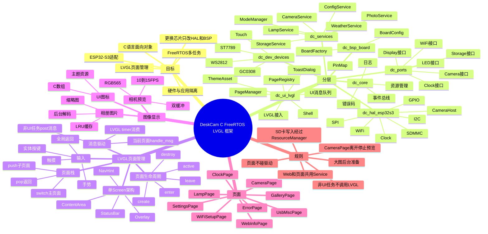
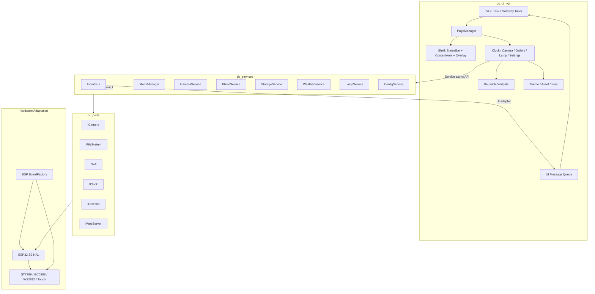
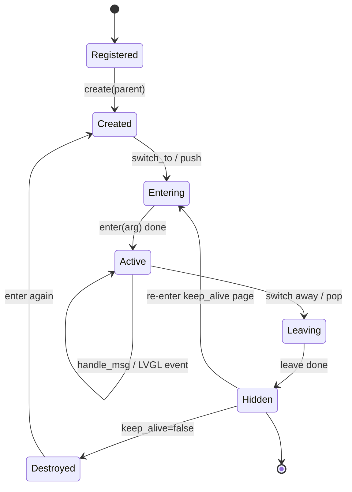
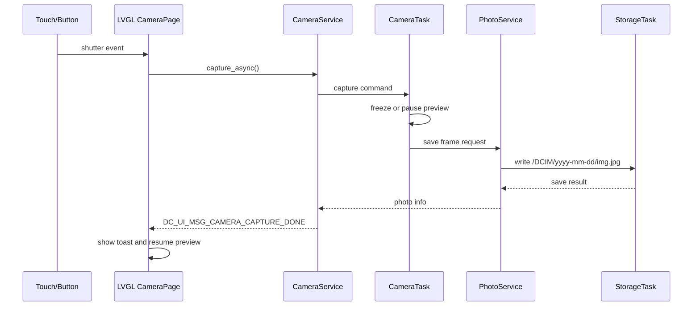

# DeskCam Clock：C 语言 + ESP32-S3 FreeRTOS + LVGL 开发框架设计

> 项目：桌面智能相机时钟 / DeskCam Clock  
> 目标平台：ESP32-S3 + ESP-IDF + FreeRTOS + LVGL  
> 开发语言：C 语言  
> UI 框架：LVGL 8/9，推荐新项目使用 LVGL 9，并通过 `esp_lvgl_port` 接入 ESP-IDF  
> 设计目标：硬件驱动、应用服务、LVGL 页面彻底分层；更换芯片或屏幕时尽量只更新底层适配层；业务服务和页面逻辑保持稳定。
>
> 目前硬件限制，暂时不考虑开发低功耗相关内容。后续可参考立创硬件开源平台，复刻锂电池版

---

## 0. 设计结论

本项目建议采用以下核心架构：

```text
app_main
  ↓
dc_app                系统启动、状态机、服务装配
  ↓
dc_services           相机、照片、天气、灯光、配置、存储、Web 等业务服务
  ↓
dc_ports              硬件能力抽象接口，应用层只依赖这里
  ↑
dc_infra              FatFS、HTTP、NVS、天气客户端、照片仓储等适配器
  ↑
dc_hal_esp32s3        ESP32-S3 芯片 HAL
  ↑
dc_dev_xxx            ST7789、GC0308、WS2812、Touch 等设备驱动
  ↑
dc_bsp_lckfb_esp32s3  板级引脚和对象装配

旁路：
dc_ui_lvgl            LVGL 页面系统，只通过 dc_services 与业务交互
```

最重要的工程规则：

```text
1. application / services 层禁止 include LVGL、ESP-IDF 具体驱动头文件。
2. LVGL 页面禁止直接调用摄像头、SD 卡、Wi-Fi、WS2812 驱动。
3. 非 UI 任务禁止直接调用 lv_obj_xxx / lv_label_xxx / lv_image_xxx 等 LVGL API。
4. 所有 UI 更新必须通过 dc_ui_post_msg() 投递到 UI 消息队列。
5. UI 页面只做显示和交互，不做耗时文件扫描、天气请求、拍照保存。
6. SD 卡访问统一经过 StorageService / PhotoService / ResourceManager。
7. 摄像头预览帧通过异步消息或共享帧缓冲交给 UI，不在 LVGL 回调中阻塞采集。
```

---

## 1. 项目目录结构

推荐使用 ESP-IDF components 组件化目录。

```text
deskcam_clock/
├── CMakeLists.txt
├── sdkconfig.defaults
├── partitions.csv
├── main/
│   ├── CMakeLists.txt
│   └── app_main.c
│
├── components/
│   ├── dc_core/
│   │   ├── CMakeLists.txt
│   │   ├── include/
│   │   │   ├── dc_err.h
│   │   │   ├── dc_log.h
│   │   │   ├── dc_result.h
│   │   │   ├── dc_time.h
│   │   │   ├── dc_color.h
│   │   │   ├── dc_image.h
│   │   │   ├── dc_event.h
│   │   │   └── dc_resource.h
│   │   └── src/
│   │       ├── dc_event_bus.c
│   │       ├── dc_resource_manager.c
│   │       └── dc_log.c
│   │
│   ├── dc_ports/
│   │   ├── CMakeLists.txt
│   │   └── include/
│   │       ├── dc_port_camera.h
│   │       ├── dc_port_display.h
│   │       ├── dc_port_touch.h
│   │       ├── dc_port_input.h
│   │       ├── dc_port_led_strip.h
│   │       ├── dc_port_wifi.h
│   │       ├── dc_port_clock.h
│   │       ├── dc_port_block_device.h
│   │       ├── dc_port_file_system.h
│   │       ├── dc_port_web_server.h
│   │       ├── dc_port_http_client.h
│   │       └── dc_port_config_store.h
│   │
│   ├── dc_services/
│   │   ├── CMakeLists.txt
│   │   ├── include/
│   │   │   ├── dc_app_context.h
│   │   │   ├── dc_app_state_machine.h
│   │   │   ├── dc_mode_manager.h
│   │   │   ├── dc_camera_service.h
│   │   │   ├── dc_photo_service.h
│   │   │   ├── dc_storage_service.h
│   │   │   ├── dc_config_service.h
│   │   │   ├── dc_time_service.h
│   │   │   ├── dc_weather_service.h
│   │   │   ├── dc_lamp_service.h
│   │   │   ├── dc_web_control_service.h
│   │   │   └── dc_input_service.h
│   │   └── src/
│   │       ├── dc_app_context.c
│   │       ├── dc_app_state_machine.c
│   │       ├── dc_mode_manager.c
│   │       ├── dc_camera_service.c
│   │       ├── dc_photo_service.c
│   │       ├── dc_storage_service.c
│   │       ├── dc_config_service.c
│   │       ├── dc_time_service.c
│   │       ├── dc_weather_service.c
│   │       ├── dc_lamp_service.c
│   │       ├── dc_web_control_service.c
│   │       └── dc_input_service.c
│   │
│   ├── dc_ui_lvgl/
│   │   ├── CMakeLists.txt
│   │   ├── idf_component.yml
│   │   ├── include/
│   │   │   ├── dc_ui.h
│   │   │   ├── dc_ui_types.h
│   │   │   ├── dc_ui_manager.h
│   │   │   ├── dc_ui_page.h
│   │   │   ├── dc_ui_page_registry.h
│   │   │   ├── dc_ui_nav.h
│   │   │   ├── dc_ui_msg.h
│   │   │   ├── dc_ui_shell.h
│   │   │   ├── dc_ui_toast.h
│   │   │   ├── dc_ui_dialog.h
│   │   │   ├── dc_ui_status_bar.h
│   │   │   ├── dc_ui_theme.h
│   │   │   ├── dc_ui_asset.h
│   │   │   └── dc_ui_preview_buffer.h
│   │   ├── src/
│   │   │   ├── dc_ui.c
│   │   │   ├── dc_ui_manager.c
│   │   │   ├── dc_ui_page.c
│   │   │   ├── dc_ui_page_registry.c
│   │   │   ├── dc_ui_nav.c
│   │   │   ├── dc_ui_msg.c
│   │   │   ├── dc_ui_shell.c
│   │   │   ├── dc_ui_toast.c
│   │   │   ├── dc_ui_dialog.c
│   │   │   ├── dc_ui_status_bar.c
│   │   │   ├── dc_ui_theme.c
│   │   │   ├── dc_ui_asset.c
│   │   │   ├── dc_ui_lvgl_port.c
│   │   │   └── dc_ui_preview_buffer.c
│   │   ├── pages/
│   │   │   ├── page_clock.c
│   │   │   ├── page_camera.c
│   │   │   ├── page_gallery.c
│   │   │   ├── page_lamp.c
│   │   │   ├── page_settings.c
│   │   │   ├── page_wifi_setup.c
│   │   │   ├── page_storage.c
│   │   │   ├── page_web_info.c
│   │   │   ├── page_usb_msc.c
│   │   │   ├── page_error.c
│   │   │   └── page_music.c
│   │   ├── widgets/
│   │   │   ├── widget_status_card.c
│   │   │   ├── widget_icon_button.c
│   │   │   ├── widget_photo_card.c
│   │   │   ├── widget_slider_row.c
│   │   │   ├── widget_confirm_dialog.c
│   │   │   └── widget_empty_state.c
│   │   ├── assets/
│   │   │   ├── icons/
│   │   │   ├── fonts/
│   │   │   └── images/
│   │   └── themes/
│   │       ├── theme_minimal.c
│   │       ├── theme_pixel_weather.c
│   │       └── theme_dashboard.c
│   │
│   ├── dc_infra_storage/
│   │   ├── include/
│   │   │   ├── dc_fatfs_file_system.h
│   │   │   ├── dc_sd_photo_repository.h
│   │   │   └── dc_json_config_store.h
│   │   └── src/
│   │       ├── dc_fatfs_file_system.c
│   │       ├── dc_sd_photo_repository.c
│   │       ├── dc_json_config_store.c
│   │       └── dc_path_policy.c
│   │
│   ├── dc_infra_network/
│   │   ├── include/
│   │   │   ├── dc_esp_http_client_adapter.h
│   │   │   ├── dc_weather_client.h
│   │   │   └── dc_esp_web_server_adapter.h
│   │   └── src/
│   │       ├── dc_esp_http_client_adapter.c
│   │       ├── dc_weather_client.c
│   │       └── dc_esp_web_server_adapter.c
│   │
│   ├── dc_hal_esp32s3/
│   │   ├── include/
│   │   │   ├── dc_esp_gpio.h
│   │   │   ├── dc_esp_spi_bus.h
│   │   │   ├── dc_esp_i2c_bus.h
│   │   │   ├── dc_esp_sdmmc_block_device.h
│   │   │   ├── dc_esp_wifi.h
│   │   │   ├── dc_esp_clock.h
│   │   │   ├── dc_esp_nvs.h
│   │   │   └── dc_esp_camera_host.h
│   │   └── src/
│   │       ├── dc_esp_gpio.c
│   │       ├── dc_esp_spi_bus.c
│   │       ├── dc_esp_i2c_bus.c
│   │       ├── dc_esp_sdmmc_block_device.c
│   │       ├── dc_esp_wifi.c
│   │       ├── dc_esp_clock.c
│   │       ├── dc_esp_nvs.c
│   │       └── dc_esp_camera_host.c
│   │
│   ├── dc_dev_display_st7789/
│   │   ├── include/dc_st7789_display.h
│   │   └── src/dc_st7789_display.c
│   │
│   ├── dc_dev_camera_gc0308/
│   │   ├── include/dc_gc0308_camera.h
│   │   └── src/dc_gc0308_camera.c
│   │
│   ├── dc_dev_led_ws2812/
│   │   ├── include/dc_ws2812_led_strip.h
│   │   └── src/dc_ws2812_led_strip.c
│   │
│   ├── dc_bsp_lckfb_esp32s3/
│   │   ├── include/
│   │   │   ├── dc_board.h
│   │   │   ├── dc_board_pins.h
│   │   │   ├── dc_board_config.h
│   │   │   └── dc_board_factory.h
│   │   └── src/
│   │       ├── dc_board.c
│   │       └── dc_board_factory.c
│   │
│   └── dc_web_static/
│       ├── CMakeLists.txt
│       └── www/
│           ├── index.html
│           ├── app.js
│           └── style.css
│
└── tools/
    ├── img_to_lvgl_asset.py
    ├── font_subset_build.sh
    └── gen_version_header.py
```

---

## 2. 总体运行模型

### 2.1 推荐任务划分

```text
FreeRTOS Tasks
├── LVGL Task                  由 esp_lvgl_port 创建或自建，唯一允许执行 LVGL API 的线程
├── AppTask                    系统状态机、模式切换、核心事件处理
├── InputTask                  按键扫描、触摸补充手势、全局快捷键
├── CameraTask                 相机预览、拍照采集、帧缓冲管理
├── StorageTask                SD 卡文件操作串行化
├── NetworkTask                Wi-Fi 重连、SNTP、天气刷新
├── WebTask                    HTTP Server 请求处理
├── LampTask                   WS2812 灯效刷新
└── AudioTask                  V2 音乐 / 电台
```

### 2.2 LVGL 单线程规则

LVGL 不是线程安全库。项目中必须采用以下规则：

```text
1. LVGL API 只允许在 LVGL Task 中调用。
2. 其他任务只能调用 dc_ui_post_msg()。
3. dc_ui_post_msg() 把 UI 更新请求放入队列。
4. LVGL Task 通过 LVGL timer 或 UI gateway 消费队列。
5. 消费消息时调用页面 on_msg()，再更新控件。
6. 中断里不能调用 LVGL，只能置位 flag 或发送轻量通知。
```

如果使用 Espressif 的 `esp_lvgl_port`，并且确实需要在非 UI 任务中直接调用 LVGL API，必须使用：

```c
lvgl_port_lock(0);
/* lv_xxx calls */
lvgl_port_unlock();
```

但本框架仍然建议：**业务任务不直接调用 LVGL，统一走 UI 消息队列。**

---

## 3. LVGL 接入方案

### 3.1 推荐方式

推荐使用：

```text
esp_lcd + esp_lvgl_port + LVGL
```

好处：

```text
1. 简化 LVGL 初始化。
2. 简化显示屏接入。
3. 简化触摸、按键、编码器、USB HID 输入接入。
4. 支持 LVGL 8 / 9。
5. 提供 lvgl_port_lock() / lvgl_port_unlock()。
6. 可配置 LVGL task sleep，降低功耗。
```

`components/dc_ui_lvgl/idf_component.yml` 示例：

```yaml
dependencies:
  espressif/esp_lvgl_port: "^2.7.2"
  lvgl/lvgl:
    version: "^9"
    public: true
```

如果你决定使用 LVGL 8：

```yaml
dependencies:
  espressif/esp_lvgl_port: "^2.7.2"
  lvgl/lvgl:
    version: "^8"
    public: true
```

建议锁定版本，不要让 UI API 在开发中自动升级导致大面积改动。

### 3.2 dc_ui_lvgl_port 职责

`dc_ui_lvgl_port.c` 只负责 LVGL 和显示输入底层接入：

```text
1. 初始化 esp_lcd panel。
2. 初始化 esp_lvgl_port。
3. 添加 ST7789 display 到 LVGL。
4. 添加 touch input 到 LVGL。
5. 添加按键 input 到 LVGL，或者把按键交给 InputTask。
6. 创建 UI 消息队列。
7. 创建 LVGL timer，用于消费 UI 消息。
8. 初始化主题、字体、全局样式。
9. 初始化 UI Shell 和 PageManager。
```

### 3.3 显示初始化伪代码

```c
#include "esp_lvgl_port.h"
#include "esp_lcd_panel_vendor.h"
#include "esp_lcd_panel_io.h"
#include "lvgl.h"
#include "dc_ui.h"
#include "dc_board_pins.h"

static lv_disp_t *s_disp;

esp_err_t dc_ui_lvgl_port_init(void)
{
    /* 1. 初始化 SPI bus */
    /* 2. 初始化 esp_lcd panel_io */
    /* 3. 初始化 ST7789 panel */

    const lvgl_port_cfg_t lvgl_cfg = ESP_LVGL_PORT_INIT_CONFIG();
    ESP_ERROR_CHECK(lvgl_port_init(&lvgl_cfg));

    const lvgl_port_display_cfg_t disp_cfg = {
        .io_handle = io_handle,
        .panel_handle = panel_handle,
        .buffer_size = DC_LCD_H_RES * 40,
        .double_buffer = true,
        .hres = DC_LCD_H_RES,
        .vres = DC_LCD_V_RES,
        .monochrome = false,
        .color_format = LV_COLOR_FORMAT_RGB565,
        .rotation = {
            .swap_xy = false,
            .mirror_x = false,
            .mirror_y = false,
        },
        .flags = {
            .buff_dma = true,
            .buff_spiram = false,
            .swap_bytes = true,
        }
    };

    s_disp = lvgl_port_add_disp(&disp_cfg);

    /* 4. 可选：初始化 touch 并注册到 LVGL */
    /* 5. 创建 LVGL timer，作为 UI gateway */
    lv_timer_create(dc_ui_gateway_timer_cb, 10, NULL);

    return ESP_OK;
}
```

### 3.4 LVGL 8 / 9 兼容层

建议封装一个 `dc_ui_lvgl_compat.h`，减少版本差异影响。

```c
#pragma once

#include "lvgl.h"

#if LVGL_VERSION_MAJOR >= 9
    #define DC_LV_SCREEN_LOAD(scr)        lv_screen_load(scr)
    #define DC_LV_SCREEN_ACTIVE()         lv_screen_active()
    #define DC_LV_IMAGE_CREATE(parent)    lv_image_create(parent)
    #define DC_LV_IMAGE_SET_SRC(obj, src) lv_image_set_src(obj, src)
#else
    #define DC_LV_SCREEN_LOAD(scr)        lv_scr_load(scr)
    #define DC_LV_SCREEN_ACTIVE()         lv_scr_act()
    #define DC_LV_IMAGE_CREATE(parent)    lv_img_create(parent)
    #define DC_LV_IMAGE_SET_SRC(obj, src) lv_img_set_src(obj, src)
#endif
```

业务页面代码尽量使用 `DC_LV_` 宏或项目封装函数，不直接散落版本相关 API。

---

## 4. UI 分层设计

### 4.1 UI 组件内部结构

```text
dc_ui_lvgl
├── dc_ui.c                  UI 对外入口
├── dc_ui_manager.c          页面管理器
├── dc_ui_page_registry.c    页面注册表
├── dc_ui_nav.c              页面栈、主页面切换、返回规则
├── dc_ui_msg.c              UI 消息队列
├── dc_ui_shell.c            全局屏幕壳：状态栏、内容区、底部导航
├── dc_ui_status_bar.c       Wi-Fi / SD / Web / Lamp / Time 状态栏
├── dc_ui_toast.c            轻提示
├── dc_ui_dialog.c           确认框、错误框、加载框
├── dc_ui_theme.c            主题和样式
├── dc_ui_asset.c            图标、图片、字体资源
├── dc_ui_preview_buffer.c   相机预览帧缓冲
├── pages/                   页面实现
└── widgets/                 可复用小控件
```

### 4.2 推荐 UI 结构：单 LVGL Screen + Shell + Page Container

LVGL 中 Screen 是顶层根对象，页面切换可以通过加载不同 screen 实现。但本项目屏幕小、状态栏常驻、页面数量多，推荐采用：

```text
一个 LVGL Screen
└── Shell Root
    ├── StatusBar       常驻顶部或底部状态栏
    ├── ContentArea     当前页面容器
    ├── NavHint         左右滑动提示 / 当前页面点位
    └── OverlayLayer    弹窗、Toast、加载层
```

页面不是直接创建成 LVGL screen，而是创建为 `ContentArea` 下的一个 root container。

优点：

```text
1. 状态栏不用每个页面重复创建。
2. 页面切换时只替换 ContentArea 内容。
3. 省内存，生命周期更可控。
4. Toast / Dialog 可以统一挂在 lv_layer_top() 或 Shell overlay。
5. 适合 2 寸屏的小设备。
```

只有以下情况建议使用独立 LVGL Screen：

```text
1. 开机 Logo。
2. 重大错误全屏页。
3. USB MSC 文件传输全屏页。
4. 需要完全不同布局的出厂测试模式。
```

---

## 5. 页面列表与页面 ID

### 5.1 页面枚举

```c
typedef enum {
    DC_PAGE_ID_BOOT = 0,
    DC_PAGE_ID_CLOCK,
    DC_PAGE_ID_CAMERA,
    DC_PAGE_ID_GALLERY,
    DC_PAGE_ID_LAMP,
    DC_PAGE_ID_SETTINGS,
    DC_PAGE_ID_WIFI_SETUP,
    DC_PAGE_ID_STORAGE,
    DC_PAGE_ID_WEB_INFO,
    DC_PAGE_ID_USB_MSC,
    DC_PAGE_ID_ERROR,

    /* V2 */
    DC_PAGE_ID_MUSIC,
    DC_PAGE_ID_RADIO,
    DC_PAGE_ID_PHOTO_FRAME,

    DC_PAGE_ID_MAX
} dc_page_id_t;
```

### 5.2 主页面顺序

```c
static const dc_page_id_t s_main_pages[] = {
    DC_PAGE_ID_CLOCK,
    DC_PAGE_ID_CAMERA,
    DC_PAGE_ID_GALLERY,
    DC_PAGE_ID_LAMP,
    DC_PAGE_ID_SETTINGS,
};
```

V2 可以扩展为：

```c
static const dc_page_id_t s_main_pages[] = {
    DC_PAGE_ID_CLOCK,
    DC_PAGE_ID_CAMERA,
    DC_PAGE_ID_GALLERY,
    DC_PAGE_ID_MUSIC,
    DC_PAGE_ID_RADIO,
    DC_PAGE_ID_LAMP,
    DC_PAGE_ID_SETTINGS,
};
```

---

## 6. 页面对象模型：C 语言面向对象

### 6.1 页面生命周期

每个页面遵循统一生命周期：

```text
REGISTERED
  ↓
CREATE       创建 LVGL 控件树
  ↓
ENTER        页面进入，启动必要服务或刷新数据
  ↓
ACTIVE       接收输入事件、服务事件、定时刷新
  ↓
LEAVE        页面离开，停止预览、保存临时状态
  ↓
DESTROY      非缓存页面释放控件和私有数据
```

### 6.2 页面接口

`dc_ui_page.h`：

```c
#pragma once

#include <stdbool.h>
#include "lvgl.h"
#include "dc_err.h"
#include "dc_ui_msg.h"

struct dc_page;
typedef struct dc_page dc_page_t;

typedef struct {
    dc_err_t (*create)(dc_page_t *page, lv_obj_t *parent);
    dc_err_t (*enter)(dc_page_t *page, const void *arg);
    dc_err_t (*leave)(dc_page_t *page);
    dc_err_t (*handle_msg)(dc_page_t *page, const dc_ui_msg_t *msg);
    dc_err_t (*handle_lv_event)(dc_page_t *page, lv_event_t *e);
    dc_err_t (*destroy)(dc_page_t *page);
} dc_page_ops_t;

typedef struct {
    dc_page_id_t id;
    const char *name;
    bool keep_alive;
    bool fullscreen;
    bool show_status_bar;
    bool allow_back;
    const dc_page_ops_t *ops;
    void *user_data;
} dc_page_desc_t;

struct dc_page {
    dc_page_desc_t desc;
    lv_obj_t *root;
    bool created;
    bool active;
    uint32_t enter_tick;
};
```

### 6.3 页面私有数据

每个页面可定义自己的 context。

```c
typedef struct {
    lv_obj_t *label_time;
    lv_obj_t *label_date;
    lv_obj_t *label_weather;
    lv_obj_t *icon_wifi;
    lv_obj_t *icon_sd;
    lv_timer_t *refresh_timer;
} page_clock_ctx_t;
```

页面注册时：

```c
static page_clock_ctx_t s_clock_ctx;

const dc_page_desc_t g_page_clock_desc = {
    .id = DC_PAGE_ID_CLOCK,
    .name = "Clock",
    .keep_alive = true,
    .fullscreen = false,
    .show_status_bar = true,
    .allow_back = false,
    .ops = &s_page_clock_ops,
    .user_data = &s_clock_ctx,
};
```

---

## 7. 页面管理器

### 7.1 PageManager 职责

```text
1. 创建 Shell。
2. 注册所有页面。
3. 维护当前页面。
4. 维护页面栈。
5. 执行页面切换动画。
6. 分发 UI 消息。
7. 分发全局手势和返回事件。
8. 控制状态栏、Toast、Dialog。
9. 管理页面生命周期和缓存策略。
```

### 7.2 页面管理器结构体

```c
#define DC_UI_NAV_STACK_DEPTH 8

typedef struct {
    lv_disp_t *disp;

    lv_obj_t *screen;
    lv_obj_t *shell_root;
    lv_obj_t *status_bar;
    lv_obj_t *content_area;
    lv_obj_t *nav_hint;
    lv_obj_t *overlay_layer;

    dc_page_t pages[DC_PAGE_ID_MAX];
    dc_page_id_t current_page;
    dc_page_id_t previous_page;

    dc_page_id_t nav_stack[DC_UI_NAV_STACK_DEPTH];
    uint8_t nav_stack_top;

    QueueHandle_t msg_queue;

    bool initialized;
} dc_ui_manager_t;
```

### 7.3 页面切换 API

```c
dc_err_t dc_ui_manager_init(dc_ui_manager_t *mgr, lv_disp_t *disp);
dc_err_t dc_ui_manager_register_page(dc_ui_manager_t *mgr, const dc_page_desc_t *desc);
dc_err_t dc_ui_manager_start(dc_ui_manager_t *mgr, dc_page_id_t first_page);

dc_err_t dc_ui_manager_switch_to(dc_ui_manager_t *mgr,
                                 dc_page_id_t page_id,
                                 const void *arg,
                                 dc_ui_anim_t anim);

dc_err_t dc_ui_manager_push(dc_ui_manager_t *mgr,
                            dc_page_id_t page_id,
                            const void *arg,
                            dc_ui_anim_t anim);

dc_err_t dc_ui_manager_pop(dc_ui_manager_t *mgr, dc_ui_anim_t anim);
dc_err_t dc_ui_manager_handle_msg(dc_ui_manager_t *mgr, const dc_ui_msg_t *msg);
```

### 7.4 页面切换流程

```text
用户左滑 / 右滑 / 点击菜单
  ↓
LVGL 事件回调
  ↓
dc_ui_manager_handle_msg()
  ↓
检查目标页面能力和模式互斥
  ↓
当前页面 leave()
  ↓
若目标页面未创建，调用 create()
  ↓
隐藏旧页面 root
  ↓
显示目标页面 root
  ↓
执行切换动画
  ↓
目标页面 enter()
  ↓
刷新状态栏和导航点位
```

### 7.5 页面栈规则

页面分为两类：

```text
主页面：Clock / Camera / Gallery / Lamp / Settings
子页面：Wi-Fi 设置 / 存储信息 / Web 地址 / 设备信息 / USB MSC
```

主页面切换使用 `switch_to()`。

```text
Clock → Camera → Gallery → Lamp → Settings
```

子页面使用 `push()` / `pop()`。

```text
Settings
  push WiFiSetup
    push WiFiPasswordInput
      pop
    pop
  push StorageInfo
    pop
```

返回规则：

```text
1. 如果 nav_stack 非空，返回上一页。
2. 如果当前是主页面且不是 Clock，双击按键返回 Clock。
3. 如果当前是 Camera，返回前必须 stop preview。
4. 如果当前是 USB MSC，返回前必须确认退出 U 盘模式。
5. 如果当前有 Dialog，先关闭 Dialog，不切页面。
```

---

## 8. UI 消息队列

### 8.1 为什么需要 UI 消息队列

本项目有很多异步事件：

```text
1. 时间每秒更新。
2. 天气刷新完成。
3. Wi-Fi 连接状态变化。
4. SD 卡挂载状态变化。
5. 拍照完成。
6. 相机预览帧到达。
7. Web 修改设置。
8. 灯效状态变化。
9. 存储空间不足。
10. USB MSC 模式进入和退出。
```

这些事件来自不同 FreeRTOS 任务，不能直接操作 LVGL。必须统一投递给 UI 队列。

### 8.2 UI 消息定义

`dc_ui_msg.h`：

```c
#pragma once

#include <stdint.h>
#include <stdbool.h>
#include "dc_image.h"
#include "dc_event.h"

#define DC_UI_MSG_QUEUE_DEPTH 16

typedef enum {
    DC_UI_MSG_NONE = 0,

    /* navigation */
    DC_UI_MSG_NAV_SWITCH,
    DC_UI_MSG_NAV_PUSH,
    DC_UI_MSG_NAV_POP,
    DC_UI_MSG_NAV_BACK_HOME,

    /* system state */
    DC_UI_MSG_SYSTEM_EVENT,
    DC_UI_MSG_STATUS_CHANGED,
    DC_UI_MSG_CONFIG_CHANGED,

    /* clock/weather */
    DC_UI_MSG_TIME_TICK,
    DC_UI_MSG_WEATHER_UPDATED,

    /* camera */
    DC_UI_MSG_CAMERA_PREVIEW_FRAME,
    DC_UI_MSG_CAMERA_CAPTURE_DONE,
    DC_UI_MSG_CAMERA_ERROR,

    /* gallery */
    DC_UI_MSG_GALLERY_LIST_READY,
    DC_UI_MSG_GALLERY_IMAGE_READY,
    DC_UI_MSG_PHOTO_DELETED,

    /* lamp */
    DC_UI_MSG_LAMP_STATE_CHANGED,

    /* storage */
    DC_UI_MSG_STORAGE_CHANGED,
    DC_UI_MSG_STORAGE_LOW_SPACE,

    /* web */
    DC_UI_MSG_WEB_STATUS_CHANGED,

    /* modal */
    DC_UI_MSG_SHOW_TOAST,
    DC_UI_MSG_SHOW_DIALOG,
    DC_UI_MSG_CLOSE_DIALOG,
} dc_ui_msg_type_t;

typedef struct {
    dc_page_id_t page_id;
    const void *arg;
} dc_ui_nav_msg_t;

typedef struct {
    const uint8_t *data;
    uint32_t size;
    uint16_t width;
    uint16_t height;
    dc_pixel_format_t format;
    uint32_t frame_id;
} dc_ui_frame_msg_t;

typedef struct {
    char text[96];
    uint32_t duration_ms;
} dc_ui_toast_msg_t;

typedef struct {
    dc_ui_msg_type_t type;
    uint32_t timestamp_ms;
    union {
        dc_ui_nav_msg_t nav;
        dc_event_t system_event;
        dc_ui_frame_msg_t frame;
        dc_ui_toast_msg_t toast;
    } data;
} dc_ui_msg_t;
```

### 8.3 UI 消息投递 API

```c
dc_err_t dc_ui_post_msg(const dc_ui_msg_t *msg, uint32_t timeout_ms);
dc_err_t dc_ui_post_nav_switch(dc_page_id_t page_id, const void *arg);
dc_err_t dc_ui_post_toast(const char *text, uint32_t duration_ms);
dc_err_t dc_ui_post_system_event(const dc_event_t *event);
```

实现要点：

```c
dc_err_t dc_ui_post_msg(const dc_ui_msg_t *msg, uint32_t timeout_ms)
{
    if (s_ui_queue == NULL || msg == NULL) {
        return DC_ERR_INVALID_ARG;
    }

    BaseType_t ok = xQueueSend(s_ui_queue, msg, pdMS_TO_TICKS(timeout_ms));
    if (ok != pdTRUE) {
        return DC_ERR_TIMEOUT;
    }

#if DC_UI_USE_ESP_LVGL_PORT
    lvgl_port_task_wake();
#endif

    return DC_OK;
}
```

### 8.4 UI Gateway Timer

```c
static void dc_ui_gateway_timer_cb(lv_timer_t *timer)
{
    dc_ui_msg_t msg;
    int handled = 0;

    while (handled < 8 && xQueueReceive(s_ui_queue, &msg, 0) == pdTRUE) {
        dc_ui_manager_handle_msg(&s_ui_manager, &msg);
        handled++;
    }
}
```

注意：

```text
1. 每次最多处理 N 条消息，避免 UI 长时间占用。
2. 耗时操作不能在这个回调里做。
3. 文件扫描、JPEG 解码、天气请求必须在服务任务中完成。
4. UI timer callback 处在 LVGL 上下文中，可以安全调用 LVGL API。
```

---

## 9. Shell 布局

### 9.1 全局布局

以 2.0 寸屏为例，假设分辨率为 240x320 或 320x240，建议使用响应式宏。

```text
竖屏 240x320：
┌──────────────────────┐
│ StatusBar  24px       │
├──────────────────────┤
│                      │
│ ContentArea          │
│                      │
│                      │
├──────────────────────┤
│ NavHint / SoftKeys    │
└──────────────────────┘

横屏 320x240：
┌────────────────────────────┐
│ StatusBar  20px             │
├────────────────────────────┤
│                            │
│ ContentArea                │
│                            │
├────────────────────────────┤
│ NavHint / SoftKeys          │
└────────────────────────────┘
```

### 9.2 Shell 对象

```c
typedef struct {
    lv_obj_t *screen;
    lv_obj_t *root;
    lv_obj_t *status_bar;
    lv_obj_t *content_area;
    lv_obj_t *nav_hint;
    lv_obj_t *overlay;
} dc_ui_shell_t;
```

### 9.3 Shell 创建伪代码

```c
dc_err_t dc_ui_shell_create(dc_ui_shell_t *shell)
{
    shell->screen = lv_obj_create(NULL);
    lv_obj_remove_style_all(shell->screen);
    lv_obj_set_size(shell->screen, LV_PCT(100), LV_PCT(100));

    shell->root = lv_obj_create(shell->screen);
    lv_obj_remove_style_all(shell->root);
    lv_obj_set_size(shell->root, LV_PCT(100), LV_PCT(100));
    lv_obj_set_flex_flow(shell->root, LV_FLEX_FLOW_COLUMN);

    shell->status_bar = dc_ui_status_bar_create(shell->root);
    lv_obj_set_size(shell->status_bar, LV_PCT(100), DC_UI_STATUS_BAR_H);

    shell->content_area = lv_obj_create(shell->root);
    lv_obj_remove_style_all(shell->content_area);
    lv_obj_set_width(shell->content_area, LV_PCT(100));
    lv_obj_set_flex_grow(shell->content_area, 1);

    shell->nav_hint = lv_obj_create(shell->root);
    lv_obj_set_size(shell->nav_hint, LV_PCT(100), DC_UI_NAV_HINT_H);

    shell->overlay = lv_obj_create(lv_layer_top());
    lv_obj_add_flag(shell->overlay, LV_OBJ_FLAG_HIDDEN);

    DC_LV_SCREEN_LOAD(shell->screen);
    return DC_OK;
}
```

---

## 10. 页面注册表

### 10.1 页面注册

`dc_ui_page_registry.c`：

```c
extern const dc_page_desc_t g_page_clock_desc;
extern const dc_page_desc_t g_page_camera_desc;
extern const dc_page_desc_t g_page_gallery_desc;
extern const dc_page_desc_t g_page_lamp_desc;
extern const dc_page_desc_t g_page_settings_desc;
extern const dc_page_desc_t g_page_wifi_setup_desc;
extern const dc_page_desc_t g_page_storage_desc;
extern const dc_page_desc_t g_page_web_info_desc;
extern const dc_page_desc_t g_page_usb_msc_desc;
extern const dc_page_desc_t g_page_error_desc;

static const dc_page_desc_t *s_page_descs[] = {
    &g_page_clock_desc,
    &g_page_camera_desc,
    &g_page_gallery_desc,
    &g_page_lamp_desc,
    &g_page_settings_desc,
    &g_page_wifi_setup_desc,
    &g_page_storage_desc,
    &g_page_web_info_desc,
    &g_page_usb_msc_desc,
    &g_page_error_desc,
};

dc_err_t dc_ui_register_all_pages(dc_ui_manager_t *mgr)
{
    for (size_t i = 0; i < DC_ARRAY_SIZE(s_page_descs); i++) {
        DC_RETURN_ON_ERROR(dc_ui_manager_register_page(mgr, s_page_descs[i]));
    }
    return DC_OK;
}
```

---

## 11. 页面切换实现要点

### 11.1 页面创建

```c
static dc_err_t dc_ui_ensure_page_created(dc_ui_manager_t *mgr, dc_page_t *page)
{
    if (page->created) {
        return DC_OK;
    }

    lv_obj_t *root = lv_obj_create(mgr->content_area);
    lv_obj_remove_style_all(root);
    lv_obj_set_size(root, LV_PCT(100), LV_PCT(100));
    lv_obj_add_flag(root, LV_OBJ_FLAG_HIDDEN);

    page->root = root;
    page->created = true;

    if (page->desc.ops && page->desc.ops->create) {
        return page->desc.ops->create(page, root);
    }

    return DC_OK;
}
```

### 11.2 页面切换

```c
dc_err_t dc_ui_manager_switch_to(dc_ui_manager_t *mgr,
                                 dc_page_id_t target_id,
                                 const void *arg,
                                 dc_ui_anim_t anim)
{
    if (target_id >= DC_PAGE_ID_MAX) {
        return DC_ERR_INVALID_ARG;
    }

    dc_page_t *old_page = &mgr->pages[mgr->current_page];
    dc_page_t *new_page = &mgr->pages[target_id];

    if (old_page->active && old_page->desc.ops && old_page->desc.ops->leave) {
        old_page->desc.ops->leave(old_page);
    }

    DC_RETURN_ON_ERROR(dc_ui_ensure_page_created(mgr, new_page));

    if (old_page->root) {
        lv_obj_add_flag(old_page->root, LV_OBJ_FLAG_HIDDEN);
    }

    lv_obj_clear_flag(new_page->root, LV_OBJ_FLAG_HIDDEN);
    lv_obj_move_foreground(new_page->root);

    if (anim != DC_UI_ANIM_NONE) {
        dc_ui_nav_run_anim(new_page->root, anim);
    }

    mgr->previous_page = mgr->current_page;
    mgr->current_page = target_id;

    new_page->active = true;
    new_page->enter_tick = lv_tick_get();

    if (new_page->desc.ops && new_page->desc.ops->enter) {
        new_page->desc.ops->enter(new_page, arg);
    }

    dc_ui_status_bar_set_visible(new_page->desc.show_status_bar);
    dc_ui_nav_hint_update(target_id);

    if (!old_page->desc.keep_alive && old_page->created) {
        if (old_page->desc.ops && old_page->desc.ops->destroy) {
            old_page->desc.ops->destroy(old_page);
        }
        lv_obj_del(old_page->root);
        old_page->root = NULL;
        old_page->created = false;
        old_page->active = false;
    }

    return DC_OK;
}
```

---

## 12. 页面缓存策略

建议策略：

| 页面 | keep_alive | 原因 |
|---|---:|---|
| Clock | true | 首页常用，控件少 |
| Lamp | true | 控件少，频繁切换 |
| Settings | true | 控件中等，常用 |
| Camera | false 或 true | root 可缓存，但预览 buffer 必须 enter/leave 管理 |
| Gallery | false | 图片资源占内存，进入时重新加载首屏 |
| WiFiSetup | false | 子页面，偶尔使用 |
| StorageInfo | false | 子页面，偶尔使用 |
| USB MSC | false | 独占模式，退出释放 |
| Error | true | 常用兜底页 |
| Music | false | V2，封面/列表资源较大 |

原则：

```text
1. 控件少、频繁进入的页面可以缓存。
2. 图片多、文件多、buffer 大的页面不缓存。
3. 缓存页面也不能缓存外设资源，例如 camera preview、SD 文件句柄。
4. 页面 leave() 必须释放服务占用，如 camera preview、gallery image buffer。
```

---

## 13. 全局输入与手势

### 13.1 输入来源

```text
1. 电容触摸：LVGL indev。
2. 实体按键：可接入 LVGL button indev，也可由 InputTask 转成 UI 消息。
3. 旋钮：V2 可接入 LVGL encoder group。
4. USB HID：V2/V3 可接入键盘鼠标。
```

### 13.2 触摸事件分层

```text
LVGL touch driver
  ↓
LVGL object event
  ↓
Widget event callback
  ↓
Page local handler
  ↓
UI Manager global gesture handler
```

局部控件优先，全局手势兜底。

### 13.3 全局手势规则

| 手势 / 按键 | 默认行为 |
|---|---|
| 左滑 | 主页面下一个 |
| 右滑 | 主页面上一个 |
| 上滑 | 亮度 + 或页面自定义 |
| 下滑 | 亮度 - 或页面自定义 |
| 单击状态栏 | 打开快捷状态页 |
| 长按内容区 | 当前页面菜单 |
| 实体键短按 | 首页快速进入相机；相机页拍照 |
| 实体键双击 | 返回时钟首页 |
| 实体键长按 | 熄屏 / 唤醒 |

### 13.4 页面拦截全局手势

页面可声明是否拦截全局手势：

```c
typedef enum {
    DC_UI_GESTURE_NONE = 0,
    DC_UI_GESTURE_SWIPE_LEFT,
    DC_UI_GESTURE_SWIPE_RIGHT,
    DC_UI_GESTURE_SWIPE_UP,
    DC_UI_GESTURE_SWIPE_DOWN,
    DC_UI_GESTURE_LONG_PRESS,
} dc_ui_gesture_t;

typedef struct {
    dc_ui_gesture_t gesture;
    int16_t x;
    int16_t y;
} dc_ui_gesture_msg_t;
```

相册页可以拦截左右滑动用于上一张/下一张，不切主页面。

相机页可以拦截单击用于对焦或快门。

设置页不建议拦截系统返回。

---

## 14. 各页面设计

## 14.1 ClockPage 时钟首页

### 职责

```text
1. 显示时间、日期、星期。
2. 显示天气图标、温度、城市。
3. 显示 Wi-Fi / SD / Web / Lamp 状态。
4. 支持主题切换：极简、像素天气、仪表盘。
5. 支持点击进入快捷菜单。
```

### 数据来源

```text
TimeService      → DC_UI_MSG_TIME_TICK
WeatherService   → DC_UI_MSG_WEATHER_UPDATED
StorageService   → DC_UI_MSG_STORAGE_CHANGED
WifiService      → DC_UI_MSG_STATUS_CHANGED
LampService      → DC_UI_MSG_LAMP_STATE_CHANGED
ConfigService    → DC_UI_MSG_CONFIG_CHANGED
```

### 页面 ctx

```c
typedef struct {
    lv_obj_t *label_time;
    lv_obj_t *label_date;
    lv_obj_t *label_weekday;
    lv_obj_t *label_city;
    lv_obj_t *label_temp;
    lv_obj_t *image_weather;
    lv_obj_t *container_status;
} page_clock_ctx_t;
```

### handle_msg 示例

```c
static dc_err_t page_clock_handle_msg(dc_page_t *page, const dc_ui_msg_t *msg)
{
    page_clock_ctx_t *ctx = page->desc.user_data;

    switch (msg->type) {
    case DC_UI_MSG_TIME_TICK:
        lv_label_set_text_fmt(ctx->label_time, "%02d:%02d", hour, minute);
        lv_label_set_text(ctx->label_date, date_str);
        break;

    case DC_UI_MSG_WEATHER_UPDATED:
        lv_label_set_text_fmt(ctx->label_temp, "%d°C", temp);
        DC_LV_IMAGE_SET_SRC(ctx->image_weather, dc_ui_weather_icon(condition));
        break;

    default:
        break;
    }

    return DC_OK;
}
```

---

## 14.2 CameraPage 相机页

### 职责

```text
1. 进入页面时请求 CameraService 启动预览。
2. 退出页面时请求 CameraService 停止预览。
3. 显示实时预览帧。
4. 显示快门按钮、倒计时、保存状态。
5. 触摸或按键触发拍照。
6. 拍照完成后显示结果和 Toast。
```

### 禁止事项

```text
1. CameraPage 不能直接调用 camera driver。
2. CameraPage 不能直接写 SD 卡。
3. CameraPage 不能在 LVGL 回调里执行拍照保存。
4. CameraPage 不持有 SD 文件句柄。
```

### 页面 ctx

```c
typedef struct {
    lv_obj_t *preview_img;
    lv_obj_t *btn_shutter;
    lv_obj_t *label_hint;
    lv_obj_t *spinner_saving;

    lv_img_dsc_t preview_dsc;
    uint8_t *preview_buf_a;
    uint8_t *preview_buf_b;
    uint8_t *active_buf;
    uint32_t last_frame_id;
    bool preview_running;
    bool saving;
} page_camera_ctx_t;
```

### enter / leave

```c
static dc_err_t page_camera_enter(dc_page_t *page, const void *arg)
{
    page_camera_ctx_t *ctx = page->desc.user_data;
    ctx->preview_running = true;
    ctx->saving = false;

    dc_camera_service_start_preview_async();
    return DC_OK;
}

static dc_err_t page_camera_leave(dc_page_t *page)
{
    page_camera_ctx_t *ctx = page->desc.user_data;
    ctx->preview_running = false;

    dc_camera_service_stop_preview_async();
    return DC_OK;
}
```

### 预览帧显示

推荐两种方案。

#### 方案 A：RGB565 预览帧 + lv_image 更新

```text
CameraTask 获取 RGB565 frame
  ↓
缩放 / 裁剪成 UI 预览尺寸
  ↓
写入 preview ring buffer
  ↓
投递 DC_UI_MSG_CAMERA_PREVIEW_FRAME
  ↓
CameraPage 更新 lv_img_dsc_t.data
  ↓
lv_obj_invalidate(preview_img)
```

示例：

```c
static dc_err_t page_camera_on_frame(page_camera_ctx_t *ctx,
                                     const dc_ui_frame_msg_t *frame)
{
    if (!ctx->preview_running || ctx->saving) {
        return DC_OK;
    }

    ctx->preview_dsc.header.w = frame->width;
    ctx->preview_dsc.header.h = frame->height;
    ctx->preview_dsc.header.cf = LV_COLOR_FORMAT_RGB565;
    ctx->preview_dsc.data_size = frame->size;
    ctx->preview_dsc.data = frame->data;

    DC_LV_IMAGE_SET_SRC(ctx->preview_img, &ctx->preview_dsc);
    lv_obj_invalidate(ctx->preview_img);

    ctx->last_frame_id = frame->frame_id;
    return DC_OK;
}
```

注意：`frame->data` 必须在 LVGL 刷新完成前有效。更安全的做法是 UI 自己维护双缓冲，收到帧后 memcpy 到 UI buffer。

#### 方案 B：lv_canvas 显示

```text
适合需要叠加滤镜、取景框、文字水印预览的场景。
```

缺点是内存占用更高。

### 拍照流程

```text
用户点击快门
  ↓
CameraPage 发送 dc_camera_service_capture_async()
  ↓
CameraTask 停止或冻结预览
  ↓
CameraService 拍照
  ↓
PhotoService 保存到 /DCIM/YYYY-MM-DD/
  ↓
保存完成后投递 DC_UI_MSG_CAMERA_CAPTURE_DONE
  ↓
CameraPage 显示保存成功 / 失败
```

### CameraPage UI 结构

```text
CameraPage
├── Preview Area
│   ├── lv_image preview
│   ├── grid overlay
│   └── saving spinner
├── Bottom Bar
│   ├── Gallery shortcut
│   ├── Shutter button
│   └── Filter button
└── Hint Label
```

---

## 14.3 GalleryPage 相册页

### 职责

```text
1. 显示 SD 卡照片列表。
2. 支持上一张 / 下一张。
3. 支持单张预览。
4. 支持空状态页面。
5. 支持删除确认。
6. 后期支持缩略图网格和自动轮播。
```

### 关键设计

相册页不能在 UI 线程中扫描整个 `/DCIM/`。

正确流程：

```text
GalleryPage enter
  ↓
PhotoService 异步扫描或读取索引
  ↓
StorageTask 执行文件操作
  ↓
返回首屏照片列表 / 缩略图列表
  ↓
GalleryPage 更新列表
```

### 图片显示策略

```text
1. 首选显示缩略图，而不是直接解码原图。
2. 缩略图尺寸建议 120x90 或 160x120。
3. 缩略图可保存为 RGB565 raw 或小 JPEG。
4. UI 仅显示当前图和前后一张缓存。
5. 不要一次性加载所有照片。
```

### GalleryPage UI 结构

```text
GalleryPage
├── EmptyState              无照片时显示
├── PhotoView
│   ├── lv_image current_photo
│   ├── label_filename
│   └── label_index
├── Bottom Actions
│   ├── Prev
│   ├── Delete
│   ├── Download Hint
│   └── Next
└── ConfirmDialog
```

---

## 14.4 LampPage 灯光页

### 职责

```text
1. 灯光开关。
2. 亮度滑条。
3. 颜色选择。
4. 模式选择：纯色、呼吸、彩虹、天气、夜灯。
5. 显示当前灯光状态。
```

### 页面规则

```text
1. 滑条变化不要每个像素都写 WS2812，可做 50~100ms 节流。
2. 页面只调用 LampService，不直接调用 LED driver。
3. Web 修改灯光后，LampPage 通过 DC_UI_MSG_LAMP_STATE_CHANGED 同步。
```

---

## 14.5 SettingsPage 设置页

### 职责

```text
1. Wi-Fi 设置入口。
2. 城市 / 天气设置入口。
3. 屏幕亮度。
4. 音量。
5. 主题。
6. SD 卡信息。
7. Web 访问地址。
8. 设备信息。
9. USB MSC 模式入口，V2。
```

### Settings 列表项模型

```c
typedef enum {
    DC_SETTING_ITEM_WIFI,
    DC_SETTING_ITEM_CITY,
    DC_SETTING_ITEM_BRIGHTNESS,
    DC_SETTING_ITEM_VOLUME,
    DC_SETTING_ITEM_THEME,
    DC_SETTING_ITEM_STORAGE,
    DC_SETTING_ITEM_WEB_INFO,
    DC_SETTING_ITEM_USB_MSC,
    DC_SETTING_ITEM_ABOUT,
} dc_setting_item_id_t;
```

点击列表项：

```c
static void page_settings_item_event_cb(lv_event_t *e)
{
    dc_setting_item_id_t item = (dc_setting_item_id_t)(uintptr_t)lv_event_get_user_data(e);

    switch (item) {
    case DC_SETTING_ITEM_WIFI:
        dc_ui_post_nav_push(DC_PAGE_ID_WIFI_SETUP, NULL);
        break;
    case DC_SETTING_ITEM_STORAGE:
        dc_ui_post_nav_push(DC_PAGE_ID_STORAGE, NULL);
        break;
    case DC_SETTING_ITEM_WEB_INFO:
        dc_ui_post_nav_push(DC_PAGE_ID_WEB_INFO, NULL);
        break;
    default:
        break;
    }
}
```

---

## 14.6 WiFiSetupPage 配网页

### 职责

```text
1. 显示当前 Wi-Fi 状态。
2. 显示 SoftAP 配网信息。
3. 显示设备 Web 地址。
4. 可输入 SSID / password，或只引导用户使用 Web 配网。
```

建议 V1 设备端只做简单入口，复杂输入交给 Web。

---

## 14.7 WebInfoPage Web 地址页

### 职责

```text
1. 显示 STA IP。
2. 显示 SoftAP SSID 和地址。
3. 显示二维码，手机扫码访问。
4. 显示 Web 控制台状态。
```

二维码生成可以放在服务层或 UI 工具层，生成后由 LVGL 显示。

---

## 14.8 USBMSCPage U 盘模式页

V2 页面。

### 职责

```text
1. 显示进入 U 盘模式确认。
2. 进入后显示“文件传输中”。
3. 提醒用户电脑安全弹出后再退出。
4. 退出时调用 UsbMscService。
```

规则：

```text
1. 进入该页面前 ModeManager 必须检查相机、音乐、Web 写入是否停止。
2. UI 页面只发出 enter/exit 请求。
3. UsbMscService 负责 SD 卡 unmount / mount 和 USB MSC 生命周期。
```

---

## 15. 状态栏设计

### 15.1 状态栏内容

```text
Wi-Fi | SD | Web | Lamp | Time
```

建议图标状态：

| 图标 | 状态 |
|---|---|
| Wi-Fi | 已连接 / 断开 / 配网中 |
| SD | 已挂载 / 未插入 / 错误 / 空间不足 |
| Web | 已启动 / 停止 / 客户端连接 |
| Lamp | 开 / 关 / 自动 |
| USB | 普通 / MSC 模式 |
| Music | V2 播放 / 暂停 |

### 15.2 状态栏更新

状态栏只订阅 UI 消息：

```text
DC_UI_MSG_STATUS_CHANGED
DC_UI_MSG_TIME_TICK
DC_UI_MSG_STORAGE_CHANGED
DC_UI_MSG_WEB_STATUS_CHANGED
DC_UI_MSG_LAMP_STATE_CHANGED
DC_UI_MSG_CONFIG_CHANGED
```

不主动查询 Wi-Fi 或 SD 卡驱动。

---

## 16. Toast / Dialog / Loading

### 16.1 Toast

用于轻提示：

```text
已拍照
保存失败：SD 卡空间不足
Wi-Fi 已连接
天气刷新失败
灯光已关闭
```

API：

```c
dc_err_t dc_ui_toast_show(const char *text, uint32_t duration_ms);
```

其他任务使用：

```c
dc_ui_post_toast("照片已保存", 1500);
```

### 16.2 Dialog

用于需要确认的操作：

```text
删除照片？
进入 USB U 盘模式？
恢复出厂设置？
重启设备？
```

Dialog 结果通过 UI 消息或 callback 发送给服务。

### 16.3 Loading Overlay

用于短时间阻塞提示：

```text
保存中...
加载相册...
连接 Wi-Fi...
进入 U 盘模式...
```

不要用 Loading 遮罩掩盖长期任务。超过 3 秒应显示可取消或错误提示。

---

## 17. 图像显示方案

本项目的图像来源有三类：

```text
1. UI 图标、天气图标、背景图。
2. 摄像头实时预览图。
3. SD 卡照片和缩略图。
```

三类图像应采用不同策略。

### 17.1 UI 图标和主题图片

推荐：编译期转为 LVGL C Array。

目录：

```text
dc_ui_lvgl/assets/icons/
dc_ui_lvgl/assets/images/
dc_ui_lvgl/themes/
```

生成：

```text
PNG/SVG 原图
  ↓
LVGL Image Converter 或 esp_lvgl_port image helper
  ↓
C array
  ↓
lv_image / lv_img 显示
```

优点：

```text
1. 不依赖 SD 卡。
2. 显示速度快。
3. 首页和错误页在无 SD 卡时仍可显示。
```

### 17.2 字体

2 寸屏需要清晰字体。建议：

```text
1. 数字时间使用大字号数字字体。
2. 中文只做必要字符子集，避免字体文件过大。
3. 常用文本尽量固定，生成子集字体。
4. 天气、设置、状态提示使用统一中小字号。
```

字体目录：

```text
dc_ui_lvgl/assets/fonts/
├── font_time_48.c
├── font_cn_16.c
└── font_icon_20.c
```

不要在每个页面重复加载字体；字体作为全局资源注册。

### 17.3 相机预览

推荐预览格式：

```text
RGB565，分辨率 160x120 / 240x180 / 240x240 裁剪
```

不推荐把完整 JPEG 预览交给 LVGL 反复解码。

推荐数据流：

```text
CameraTask
  ↓ 获取 frame
CameraService
  ↓ 缩放/裁剪/格式转换
PreviewBuffer
  ↓ 投递 frame_id
UI Gateway
  ↓ CameraPage 更新 lv_image
LCD flush
```

### 17.4 SD 卡照片显示

不要直接在 UI 线程读取大 JPEG。

推荐流程：

```text
GalleryPage 请求显示照片
  ↓
PhotoService 异步准备缩略图
  ↓
StorageTask 读取文件
  ↓
ImageDecodeTask 可选解码 / 缩放
  ↓
返回 RGB565 小图 buffer 或缩略图路径
  ↓
UI 显示
```

照片目录：

```text
/DCIM/2026-05-13/IMG_20260513_143205.jpg
/THUMB/2026-05-13/IMG_20260513_143205.rgb565
```

缩略图建议：

```text
1. 宽度不超过屏幕宽度。
2. RGB565 raw 速度最快，但占用更大。
3. 小 JPEG 更省空间，但解码耗 CPU。
4. V1 可以先不做缩略图网格，只做单张浏览。
```

### 17.5 图像内存预算

以 RGB565 为例：

| 尺寸 | 内存 |
|---|---:|
| 160x120 | 37.5 KB |
| 240x180 | 84.4 KB |
| 240x240 | 112.5 KB |
| 320x240 | 150 KB |

建议：

```text
1. 相机预览双缓冲最多 2 个中等尺寸 buffer。
2. Gallery 当前图 + 预加载下一图，最多 2 个显示 buffer。
3. 尽量使用 PSRAM 放图像大 buffer。
4. DMA flush buffer 放 internal SRAM。
5. UI 小控件和 LVGL 对象避免频繁 create/destroy。
```

---

## 18. 相机预览缓冲设计

### 18.1 PreviewBuffer 模块

```c
typedef struct {
    uint8_t *buf[2];
    size_t buf_size;
    uint8_t write_index;
    uint8_t read_index;
    uint32_t frame_id;
    SemaphoreHandle_t mutex;
} dc_ui_preview_buffer_t;
```

### 18.2 写入流程

```c
dc_err_t dc_ui_preview_buffer_write(dc_ui_preview_buffer_t *pb,
                                    const uint8_t *src,
                                    size_t size,
                                    uint16_t w,
                                    uint16_t h)
{
    xSemaphoreTake(pb->mutex, portMAX_DELAY);

    uint8_t idx = pb->write_index;
    memcpy(pb->buf[idx], src, size);
    pb->read_index = idx;
    pb->write_index ^= 1;
    pb->frame_id++;

    xSemaphoreGive(pb->mutex);

    dc_ui_msg_t msg = {
        .type = DC_UI_MSG_CAMERA_PREVIEW_FRAME,
        .timestamp_ms = dc_time_millis(),
    };
    msg.data.frame.data = pb->buf[idx];
    msg.data.frame.size = size;
    msg.data.frame.width = w;
    msg.data.frame.height = h;
    msg.data.frame.format = DC_PIXEL_FORMAT_RGB565;
    msg.data.frame.frame_id = pb->frame_id;

    return dc_ui_post_msg(&msg, 0);
}
```

### 18.3 注意点

```text
1. 不要在 UI 线程等待 camera frame。
2. CameraTask 不能覆盖 LVGL 正在读取的 buffer。
3. 简化版本可以 UI 收到后复制到自身 active_buf。
4. 高帧率不是目标，10~15 FPS 对小相机预览足够。
5. 拍照保存时可暂停预览，释放 SD 写入带宽。
```

---

## 19. 页面与服务交互

### 19.1 交互原则

```text
Page → Service：调用异步命令 API。
Service → Page：发布 EventBus 事件，UI 转为 dc_ui_msg_t。
```

页面不应直接调用底层 port。

错误示例：

```c
/* 错误：页面直接操作驱动 */
dc_camera_capture_jpeg(camera, &frame);
dc_file_write(fs, path, frame.data, frame.size);
```

正确示例：

```c
/* 正确：页面请求应用服务 */
dc_camera_service_capture_async();
```

### 19.2 UI Adapter

建议在 `dc_app` 或 `dc_services` 中做一个 UI adapter，把系统事件转成 UI 消息。

```c
static void app_on_event(const dc_event_t *event, void *user_data)
{
    dc_ui_msg_t msg = {0};

    switch (event->type) {
    case DC_EVENT_TIME_TICK:
        msg.type = DC_UI_MSG_TIME_TICK;
        break;
    case DC_EVENT_WEATHER_UPDATED:
        msg.type = DC_UI_MSG_WEATHER_UPDATED;
        break;
    case DC_EVENT_PHOTO_CAPTURED:
        msg.type = DC_UI_MSG_CAMERA_CAPTURE_DONE;
        break;
    case DC_EVENT_STORAGE_CHANGED:
        msg.type = DC_UI_MSG_STORAGE_CHANGED;
        break;
    default:
        msg.type = DC_UI_MSG_SYSTEM_EVENT;
        msg.data.system_event = *event;
        break;
    }

    dc_ui_post_msg(&msg, 0);
}
```

---

## 20. 事件总线与 UI 消息关系

```text
硬件 / 服务事件
  ↓
EventBus: dc_event_t
  ↓
App Event Adapter
  ↓
UI Queue: dc_ui_msg_t
  ↓
LVGL Gateway Timer
  ↓
PageManager
  ↓
当前 Page / StatusBar / Dialog
```

事件总线面向整个系统，UI 消息只面向 LVGL。

不要把 LVGL 对象指针放入系统 EventBus。

---

## 21. 页面状态机

### 21.1 系统状态与页面状态分离

系统模式：

```text
BOOT
INIT_HARDWARE
LOAD_CONFIG
MOUNT_SD
CONNECT_WIFI
SYNC_TIME
RUNNING
USB_MSC
ERROR
```

UI 页面：

```text
Clock
Camera
Gallery
Lamp
Settings
WiFiSetup
Storage
WebInfo
UsbMsc
Error
```

系统模式决定能不能进入某页面，但页面不是系统模式本身。

示例：

```text
SystemMode = RUNNING
UI Page 可以是 Clock / Camera / Gallery / Lamp / Settings

SystemMode = USB_MSC
UI Page 必须是 UsbMsc

SystemMode = ERROR
UI Page 可以是 Error，也可以带有可恢复操作
```

### 21.2 页面进入检查

```c
bool dc_ui_can_enter_page(dc_page_id_t page_id)
{
    switch (page_id) {
    case DC_PAGE_ID_CAMERA:
        return dc_mode_manager_can_use_camera() && dc_storage_service_is_ready();
    case DC_PAGE_ID_GALLERY:
        return dc_storage_service_is_ready();
    case DC_PAGE_ID_USB_MSC:
        return dc_mode_manager_can_enter_usb_msc();
    default:
        return true;
    }
}
```

如果不能进入：

```text
1. 不切页面。
2. 显示 Toast 或 Dialog。
3. 可跳转到 Settings / Storage / WiFiSetup。
```

---

## 22. FreeRTOS 优先级建议

| 任务 | 优先级建议 | 栈建议 | 说明 |
|---|---:|---:|---|
| LVGL Task | 4~5 | 6~10 KB | UI 绘制，不能被长期饿死 |
| CameraTask | 5 | 6~10 KB | 预览采集，注意限帧 |
| StorageTask | 3 | 5~8 KB | 文件操作串行化 |
| WebTask | 3 | 6~10 KB | HTTP 请求，不可长时间占用 |
| NetworkTask | 2~3 | 4~6 KB | Wi-Fi / SNTP / 天气 |
| LampTask | 2~3 | 3~5 KB | WS2812 刷新 |
| InputTask | 4 | 3~4 KB | 按键响应要及时 |
| AppTask | 4 | 4~6 KB | 状态机、事件分发 |
| AudioTask | 4~5 | 8~12 KB | V2 音频播放 |

注意：

```text
1. 优先级要结合实际测试调整。
2. LVGL Task 不做文件扫描和网络请求。
3. CameraTask 预览帧率要限流，避免挤占 UI。
4. Web 下载大文件应分块发送，避免占用大内存。
5. StorageTask 是 SD 卡写入仲裁核心。
```

---

## 23. CMake 与依赖

### 23.1 dc_ui_lvgl/CMakeLists.txt

```cmake
idf_component_register(
    SRCS
        "src/dc_ui.c"
        "src/dc_ui_manager.c"
        "src/dc_ui_page.c"
        "src/dc_ui_page_registry.c"
        "src/dc_ui_nav.c"
        "src/dc_ui_msg.c"
        "src/dc_ui_shell.c"
        "src/dc_ui_toast.c"
        "src/dc_ui_dialog.c"
        "src/dc_ui_status_bar.c"
        "src/dc_ui_theme.c"
        "src/dc_ui_asset.c"
        "src/dc_ui_lvgl_port.c"
        "src/dc_ui_preview_buffer.c"
        "pages/page_clock.c"
        "pages/page_camera.c"
        "pages/page_gallery.c"
        "pages/page_lamp.c"
        "pages/page_settings.c"
        "pages/page_wifi_setup.c"
        "pages/page_storage.c"
        "pages/page_web_info.c"
        "pages/page_usb_msc.c"
        "pages/page_error.c"
        "widgets/widget_status_card.c"
        "widgets/widget_icon_button.c"
        "widgets/widget_photo_card.c"
        "widgets/widget_slider_row.c"
        "widgets/widget_confirm_dialog.c"
        "widgets/widget_empty_state.c"
        "themes/theme_minimal.c"
        "themes/theme_pixel_weather.c"
        "themes/theme_dashboard.c"
    INCLUDE_DIRS
        "include"
    REQUIRES
        dc_core
        dc_services
        dc_ports
        esp_lvgl_port
        lvgl
)
```

### 23.2 sdkconfig.defaults 示例

```text
# PSRAM
CONFIG_SPIRAM=y
CONFIG_SPIRAM_USE_MALLOC=y

# LVGL
CONFIG_LV_COLOR_DEPTH_16=y
CONFIG_LV_USE_LOG=y
CONFIG_LV_USE_ASSERT_NULL=y
CONFIG_LV_USE_ASSERT_MALLOC=y
CONFIG_LV_USE_ASSERT_STYLE=y

# 性能调试，发布版可关闭
# CONFIG_LV_USE_PERF_MONITOR=y
# CONFIG_LV_USE_MEM_MONITOR=y

# 文件系统与 SD 卡
CONFIG_FATFS_LFN_HEAP=y
CONFIG_FATFS_MAX_LFN=255

# HTTP Server
CONFIG_HTTPD_MAX_REQ_HDR_LEN=1024
CONFIG_HTTPD_MAX_URI_LEN=512
```

具体 Kconfig 名称会随 LVGL / ESP-IDF 版本变化，最终以 `idf.py menuconfig` 为准。

---

## 24. 页面文件模板

`pages/page_xxx.c` 推荐模板：

```c
#include "dc_ui_page.h"
#include "dc_ui_msg.h"
#include "dc_ui_toast.h"
#include "dc_services.h"
#include "lvgl.h"

typedef struct {
    lv_obj_t *root_container;
    lv_obj_t *title;
} page_xxx_ctx_t;

static page_xxx_ctx_t s_ctx;

static dc_err_t page_xxx_create(dc_page_t *page, lv_obj_t *parent)
{
    page_xxx_ctx_t *ctx = page->desc.user_data;

    ctx->root_container = lv_obj_create(parent);
    lv_obj_set_size(ctx->root_container, LV_PCT(100), LV_PCT(100));
    lv_obj_set_flex_flow(ctx->root_container, LV_FLEX_FLOW_COLUMN);

    ctx->title = lv_label_create(ctx->root_container);
    lv_label_set_text(ctx->title, "Page Title");

    return DC_OK;
}

static dc_err_t page_xxx_enter(dc_page_t *page, const void *arg)
{
    return DC_OK;
}

static dc_err_t page_xxx_leave(dc_page_t *page)
{
    return DC_OK;
}

static dc_err_t page_xxx_handle_msg(dc_page_t *page, const dc_ui_msg_t *msg)
{
    switch (msg->type) {
    default:
        break;
    }
    return DC_OK;
}

static dc_err_t page_xxx_destroy(dc_page_t *page)
{
    page_xxx_ctx_t *ctx = page->desc.user_data;
    memset(ctx, 0, sizeof(*ctx));
    return DC_OK;
}

static const dc_page_ops_t s_ops = {
    .create = page_xxx_create,
    .enter = page_xxx_enter,
    .leave = page_xxx_leave,
    .handle_msg = page_xxx_handle_msg,
    .destroy = page_xxx_destroy,
};

const dc_page_desc_t g_page_xxx_desc = {
    .id = DC_PAGE_ID_XXX,
    .name = "XXX",
    .keep_alive = true,
    .fullscreen = false,
    .show_status_bar = true,
    .allow_back = true,
    .ops = &s_ops,
    .user_data = &s_ctx,
};
```

---

## 25. 页面与 Web 控制台同步

Web 修改设置后：

```text
POST /api/config
  ↓
ConfigController
  ↓
ConfigService 保存配置
  ↓
EventBus 发布 CONFIG_CHANGED
  ↓
UI Adapter 投递 DC_UI_MSG_CONFIG_CHANGED
  ↓
SettingsPage / ClockPage / StatusBar 更新显示
```

Web 控制灯光后：

```text
POST /api/lamp/brightness
  ↓
LampService 更新状态
  ↓
LampTask 刷新 WS2812
  ↓
EventBus 发布 LAMP_STATE_CHANGED
  ↓
LampPage 同步 slider
```

页面和 Web 必须走同一套 Service，避免状态不一致。

---

## 26. UI 错误处理

### 26.1 错误展示等级

| 等级 | 方式 | 示例 |
|---|---|---|
| Info | Toast | Wi-Fi 已连接 |
| Warning | Toast + 状态栏图标 | SD 卡空间不足 |
| Error | Dialog | 摄像头初始化失败 |
| Fatal | ErrorPage | 关键服务启动失败 |

### 26.2 空状态组件

统一使用 `widget_empty_state`：

```text
无 Wi-Fi：未连接 Wi-Fi，点击进入配网
无 SD：未检测到 SD 卡
无照片：还没有照片，去拍一张吧
无天气：天气暂不可用
摄像头错误：摄像头初始化失败
```

---

## 27. 主题系统

### 27.1 主题结构

```c
typedef enum {
    DC_UI_THEME_MINIMAL = 0,
    DC_UI_THEME_PIXEL_WEATHER,
    DC_UI_THEME_DASHBOARD,
} dc_ui_theme_id_t;

typedef struct {
    dc_ui_theme_id_t id;
    const char *name;
    lv_color_t color_bg;
    lv_color_t color_card;
    lv_color_t color_text;
    lv_color_t color_muted;
    lv_color_t color_accent;
    const lv_font_t *font_time;
    const lv_font_t *font_title;
    const lv_font_t *font_body;
} dc_ui_theme_t;
```

### 27.2 主题切换规则

```text
1. ConfigService 保存当前主题 id。
2. UI 收到 CONFIG_CHANGED 后切换主题。
3. 对全局 style 使用 lv_style_t，并统一刷新页面。
4. 不建议每个控件硬编码颜色和字体。
```

---

## 28. 性能与内存建议

### 28.1 LVGL 刷新

```text
1. 屏幕 flush buffer 推荐使用 DMA-capable internal SRAM。
2. 大图像 buffer 可放 PSRAM。
3. 预览帧率限制到 10~15 FPS。
4. 页面切换动画控制在 150~250ms。
5. 大量列表使用分页，不一次性创建所有 item。
6. UI Gateway 每次最多处理固定数量消息。
7. Toast、Dialog 使用对象复用，避免频繁 malloc/free。
```

### 28.2 相册性能

```text
1. V1 单张浏览，不做大量缩略图网格。
2. V2 再加入缩略图索引和 LRU cache。
3. 图片解码在后台任务完成。
4. GalleryPage 不直接扫目录。
```

### 28.3 相机预览性能

```text
1. CameraTask 丢弃旧帧，不堆积。
2. UI 只显示最新帧。
3. 页面不可见时停止预览。
4. 拍照保存期间可暂停预览。
5. 低电量或过热时降低帧率，后期扩展。
```

---

## 29. 开发顺序

建议按下面顺序落地：

```text
第 1 步：创建 components 目录和 dc_core / dc_ports / dc_services / dc_ui_lvgl。
第 2 步：接入 esp_lvgl_port，点亮 ST7789，显示 Hello 页面。
第 3 步：实现 Shell：StatusBar + ContentArea + Toast。
第 4 步：实现 PageManager：注册页、切页、页面栈。
第 5 步：实现 ClockPage，显示本地时间假数据。
第 6 步：实现 UI 消息队列，TimeService 每秒更新时间。
第 7 步：实现 SettingsPage、WebInfoPage。
第 8 步：实现 Wi-Fi 状态栏和天气更新。
第 9 步：实现 SD 卡 StorageService，GalleryPage 空状态和照片列表。
第 10 步：实现 CameraPage 静态预览占位。
第 11 步：接入 CameraTask RGB565 预览帧。
第 12 步：接入拍照保存流程。
第 13 步：实现 LampPage 和 WS2812 服务联动。
第 14 步：实现 Web 控制台与 UI 状态同步。
第 15 步：长时间运行测试和内存泄漏检查。
```

---

## 30. 最小可运行 UI 骨架

### 30.1 app_main.c

```c
#include "dc_board_factory.h"
#include "dc_app_context.h"
#include "dc_ui.h"

void app_main(void)
{
    dc_board_t *board = dc_board_create();
    dc_app_context_t app;

    dc_app_context_init(&app, board);
    dc_app_context_start_services(&app);

    dc_ui_init(&app);
    dc_ui_start(DC_PAGE_ID_CLOCK);

    dc_app_state_machine_start(&app);
}
```

### 30.2 dc_ui_init

```c
dc_err_t dc_ui_init(dc_app_context_t *app)
{
    s_app = app;

    DC_RETURN_ON_ERROR(dc_ui_lvgl_port_init());
    DC_RETURN_ON_ERROR(dc_ui_msg_queue_init());
    DC_RETURN_ON_ERROR(dc_ui_manager_init(&s_ui_manager, dc_ui_get_display()));
    DC_RETURN_ON_ERROR(dc_ui_register_all_pages(&s_ui_manager));

    return DC_OK;
}
```

### 30.3 dc_ui_start

```c
dc_err_t dc_ui_start(dc_page_id_t first_page)
{
    lvgl_port_lock(0);
    dc_ui_manager_start(&s_ui_manager, first_page);
    lvgl_port_unlock();

    return DC_OK;
}
```

如果 `dc_ui_start()` 已经在 LVGL Task / LVGL timer 中执行，则不需要 lock。项目中要统一一种模式。

---

## 31. UI 编码规范

```text
1. 所有 LVGL 控件指针只存在 dc_ui_lvgl 组件内部。
2. 页面 ctx 不能暴露给其他组件。
3. 页面只调用 Service API，不能调用 HAL / Driver。
4. Service 回调不能直接操作 LVGL。
5. 页面创建控件必须在 create()。
6. 页面进入时启动异步请求，离开时停止页面相关活动。
7. 页面 destroy() 必须清空 ctx 中失效指针。
8. 长列表必须分页或虚拟化。
9. 大图片必须异步准备。
10. Toast/Dialog 统一使用 dc_ui_toast / dc_ui_dialog。
11. 颜色、字体、间距统一走 theme/style。
12. 禁止在 LVGL 回调里 vTaskDelay、网络请求、文件扫描。
13. 禁止在中断里调用 LVGL。
14. 禁止在 CameraTask 里调用 lv_image_set_src。
15. 禁止在 WebTask 里调用 lv_label_set_text。
```

---

## 32. 测试计划

### 32.1 UI 单元测试 / 模拟测试

```text
1. PageManager 注册页数量正确。
2. switch_to 调用 leave / enter 顺序正确。
3. push / pop 栈行为正确。
4. 页面 keep_alive 策略正确。
5. 非法 page_id 返回错误。
6. Toast 队列溢出时不崩溃。
7. UI 消息队列满时降级处理。
```

### 32.2 硬件联调测试

```text
1. 上电显示 BootPage，然后进入 ClockPage。
2. Wi-Fi 断开 / 重连，状态栏正确变化。
3. SD 卡插入 / 拔出，状态栏和相册页正确变化。
4. 进入 CameraPage，预览开始；离开 CameraPage，预览停止。
5. 拍照保存时 UI 显示 saving，不假死。
6. Web 删除照片后 GalleryPage 刷新。
7. 灯光页面滑动亮度，WS2812 响应且 UI 不明显卡顿。
8. 长时间切页面 1000 次，不出现内存持续增长。
```

### 32.3 压力测试

```text
1. Camera preview 运行 30 分钟。
2. 时钟首页运行 24 小时。
3. 连续拍照 100 张。
4. Web 下载照片时切换 UI 页面。
5. Wi-Fi 反复断开重连。
6. SD 卡空间不足时拍照。
7. UI 消息高频投递，确认队列不会导致崩溃。
```

---

## 33. Mermaid 思维导图



---

## 34. Mermaid 架构图



---

## 35. Mermaid 页面生命周期图



---

## 36. Mermaid 相机预览时序图



---

## 37. 参考资料

- LVGL ESP-IDF 集成：`https://lvgl.io/docs/open/integration/chip_vendors/espressif/add_lvgl_to_esp32_idf_project`
- LVGL 显示与 Screen：`https://lvgl.io/docs/open/8.3/overview/display`
- LVGL 线程注意事项：`https://lvgl.100ask.net/master/intro/add-lvgl-to-your-project/threading.html`
- Espressif `esp_lvgl_port`：`https://components.espressif.com/components/espressif/esp_lvgl_port`
- ESP-IDF 文档：`https://docs.espressif.com/projects/esp-idf/`

---

## 38. 最终推荐落地形态

最终推荐你的 V1 UI 框架定为：

```text
ESP-IDF component project
  + C opaque handle / ops 函数表
  + FreeRTOS 多任务
  + EventBus 系统事件
  + ResourceManager 资源互斥
  + esp_lvgl_port 接入 LVGL
  + 单 LVGL Screen + Shell 页面壳
  + PageManager 页面生命周期
  + UI Message Queue 单线程网关
  + Camera preview 双缓冲
  + Gallery 后台缩略图
  + Web / UI 共用 Service
```

一句话：

```text
LVGL 只负责显示和交互，业务在 Service，硬件在 Port/HAL/BSP，任务之间靠事件和消息队列协作。
```


核心方案：

```
ESP-IDF + FreeRTOS + LVGL
  + esp_lvgl_port
  + 单 LVGL Screen
  + Shell 页面壳
  + PageManager 页面管理器
  + PageRegistry 页面注册表
  + UI Message Queue
  + LVGL Gateway Timer
  + 页面生命周期 create / enter / active / leave / destroy
```

LVGL 只在 UI 线程中运行，其他任务通过 `dc_ui_post_msg()` 投递消息。


